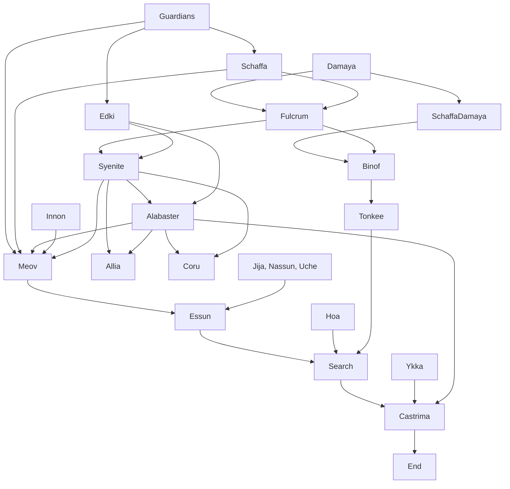

## Summary and analysis of The Fifth Season (Nora K. Jemisin)

As I announced in the my [book review of 2019](/book-review), I obtained a small stipend to organize a reading group on the topic of Afrofuturism.
One novel that was particularly interesting was the Fifth Season, the first novel of the Broken Earth trilogy by Nora K. Jemisin.
After trying around with the format in [a first video](https://www.youtube.com/watch?v=Vy53sInWvdM) on the novel Binti by Nnedi Okorafor, I tried to refine
the process a bit more. The result is are another video, a few slides, and a nice diagram I made with [mermaid](https://mermaidjs.github.io/) (great package!)

Naturally, the video contains major spoilers.

where you can find the slides [here](/images/fs/fs_presentation.pdf)

with the code simply

