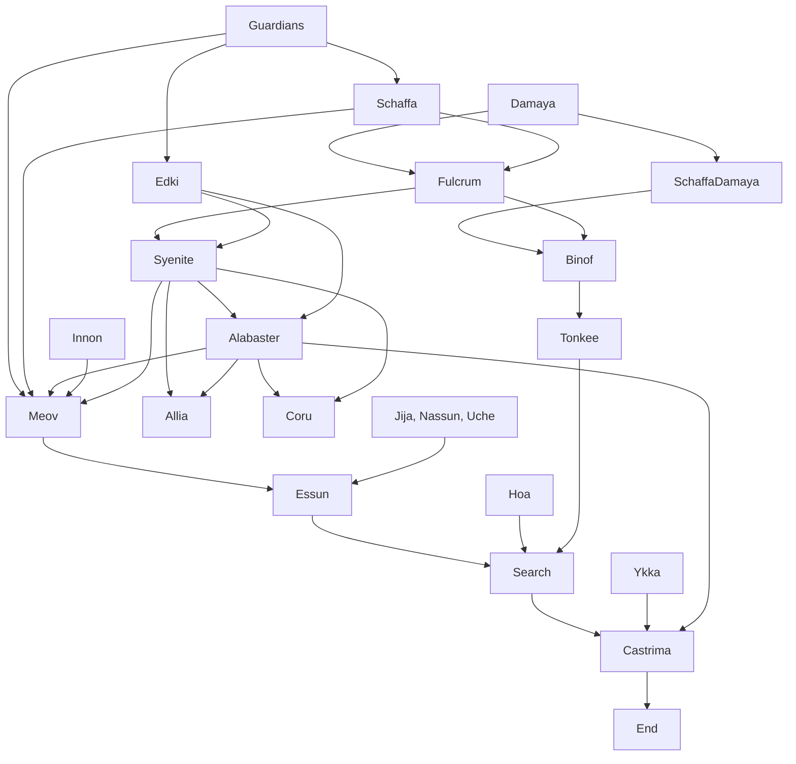

As I announced in the my [book review of 2019](/book-review), I obtained a small stipend to organize a reading group on the topic of Afrofuturism.
One novel that was particularly interesting was the Fifth Season, the first novel of the Broken Earth trilogy by Nora K. Jemisin.
After trying around with the format in [a first video](https://www.youtube.com/watch?v=Vy53sInWvdM) on the novel Binti by Nnedi Okorafor, I tried to refine
the process a bit more. The result is are another video, a few slides, and a nice diagram I made with [mermaid](https://mermaidjs.github.io/) (great package!)

Naturally, the video contains major spoilers.

where you can find the slides [here](/images/fs/fs_presentation.pdf) and my goodreads review [here](https://www.goodreads.com/review/show/3339446261).

## Intro

* **Nora K. Jemisin** has won three Hugo Awards for best novel in three years in a row for all three installments of the series; also first African American writer to win the Hugo award. 
* She was very self-conscious about it; even about the Fifth Season trilogy.
* **Setting**: Continent Stillness which is confronted with existential seismic events every couple of years.

## Timeline

Damaya: 2, 6, 11, 17
Syenite: 4, 8, 9, 12, 14, 16, 19, 20, 22
Essun: 1, 3, 5, 7, 10, 13, 15, 18, 21, 23

*code for Mermaid diagram at the end.*

### Damaya
* **Damaya**, an **orogene**, is collected by **Schaffa** from her bad parents and scares her (2, 6)
* She is trained at the **Fulcrum**, meets Maxixe, Crack, and others, but doesn't have a lot of friends (11)
* Meets a girl who isn't an orogene, **Binof**, and discovers an ancient socket under the Fulcrum (17)
* Binof gets taken away and Damaya chooses her orogene name **Syenite** (17f)

### Syenite
* Syenite gets assigned a job in **Allia** together with 10-ringer **Alabaster** & get a child with him (4)
* On the way she learns the terrible truth about nodes (8)
* Along the inhospitality at Allia, there is an attempt to murder Alabaster by poison (9)
* Syenite removes coral from the harbor and reveals an **obelisk** (12)
* A **Guardian** named Edki attacks and almost kills them; Syen destroys the obelisk using her power (14)
* **Stone eater** named Antimony brings them to pirate island **Meov** (16)
* They stay at Meov for about 2 y and form a relationship with **Innon** and others. Polyamorous relationship with Alabaster x Syenite x Innon (19, Interlude II, 20)
* They get found out by Guardians (incl. Schaffa) which come and kill Innon and most others; Syenite triggers cataclysmic event, kills her son **Corundum** and all around; Alabaster vanishes into the earth (22)
* She travels the Stillness for 2 y; settles in Tirimo for 10 y, changes her name to **Essun** (22f)

### Essun
* Alabaster triggers a **fifth season** somewhere else (Prologue)
* **Jija**, Essun's new husband, kills her son **Uche** and kidnaps her daughter **Nassun** (orogenes) (1, 3)
* **Hoa**, the stone eater joins Essun to find her daughter / kill her husband. He senses orogenes. (5, 7)
* They meet **Tonkee** on the way and Hoa kills a kirkhusa; follow the orogene 'signal' (10, 13)
* They find an underground comm, Castrima. **Ykka** and other orogenes live there (15, 18)
* Turns out Tonkee is Binof. Obelisks follow Essun (21)
* Hoa 'guarded' Essun for a long time. 
* Antimony brings Alabaster who is almost dead about and he says 'Have you ever heard of something called a moon?' (as foreshadowed by Interlude I) (23)

## Themes

* Themes: Stone doesn't perish ... yet humans still manage to change it.
* Subvert expectations, e.g. in identity of protagonist ("40 something black, overweight woman")
* Fun, interesting, second person authorial voice <- video game nerd.
* Hierarchies and the power of narratives

## Mermaid code

