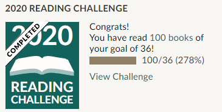
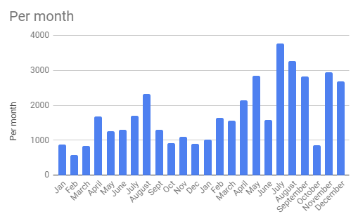
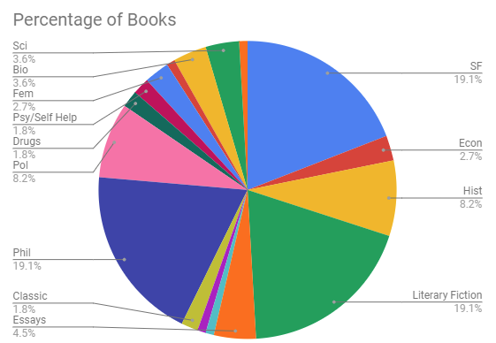
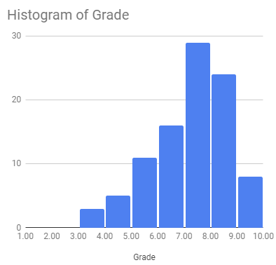

BookReview 2020

# Corona made me read a bunch 

For the list, scroll to the bottom of the page. My [goodreads](https://www.goodreads.com/user/show/21258671-stefan-gugler). 

Still spurred from [last year's joy](https://sgugler.github.io/book-review/) of getting through a bunch of books that were waiting on my shelf for years, I set out to repeat the effort in 2020. One take away from last year was, that the challenge is great, because it is very motivating, yet reading itself shouldn't become a 'commodity' for myself and even less so one to flaunt around (which I guess I'm a bit susceptible to). A consequence of this was that I tuned down my goal of 50 books to 36. I did this because I felt that towards the end of last year, I was actively looking for shorter and/or less complicated reads, just to get to the 50. That's not bad *per se* but not really how I want to go about this. Soon after corona hit, it became clear though that 36 books would be easy for me this year.

Early December I reached 100 books, or 278% of what I set out to read.

So because corona happened, my university moved work to remote office pretty early in the year, which allowed me to plan my day more freely. The "less nice" thing is, of course, that my productivity in terms of work output sank*; some days quite a bit. Reading is a very meaningful activity in these moments of motivational dearth as opposed to browsing the internet or playing video games. So in a way it's sometimes easier to stop browsing the internet and get back to work than stop *reading* and get back to work, because reading is already meaningful. Luckily, my work fulfills this generally, too.

*I really enjoy my work, and even though it comes across as a tedious chore, I don't mean it that way. 

## Reading diversity and selection criteria

I made some comments [last year](https://sgugler.github.io/book-review/) on how to achieve a diverse reading list. In a nutshell, whereas I think it's important that inspiration or a particular interest should come organically, a de-biasing process is *also* important, because whatever comes organically is still influenced by society. Getting rid of these pre-conceived notions is a good thing, even though it might look like a quota at first. More complicatedly, as a direct quote from last year:

> The intuitive/’random-gut-feeling’ selection process is a manifestation of the (here white patriarchal) society I was raised in and the overriding urge to de-bias the reading list is a [(feminist, anti-racist)] reflection on said society that counteracts it.

[I would add that: This 'reflection' still dialectically purports the ramifications of the subverted system via negative space, but at this point I don't know how to embody higher-order anti-oppressive actions from a theory POV.]

As I also 'teased' last year, we had an afrofuturist reading group during summer, for which I was able to buy all the books for the participants, due to a small grant. It was an all around great experience (read Butler, Jemisin, Okorafor, Du Bois, Womack.)

## Some stats

It's always nice to look at some graphs and numbers, so let us look at some graphs and numbers.

Officially suspended: 7 [books I put on the suspended list]

De facto suspended: 6 [books I didn't touch for a while yet refuse to put on the suspended list]

| Feature                 | Average                        |
| ----------------------- | ------------------------------ |
| Average pages per month | 2162 (std: 930) |
| Average pages per book  | 281 (std: 169) |
| Median pages per book   | 244                          |
| Number of books         | 105                            |

The first half is 2019, the second half is 2020. June seems low but that's just an artifact of the binning, because I track the books only over months. I want to say that the trend correlates a bit with corona but what's statistics anyways.

The rating looks a bit like the following. It might be strange that it is skewed towards the upper half (which is a trend that is observable in almost all online review/voting processes). I explain it such that people already know what they might like and their ratings being skewed towards good is an artifact of them being good selectors and confirmation bias (because you want to like what you selected/consumed).

And a tiny comment on what 'constitutes' a book. When talking about numbers and "how many books did you read" comes up (apart from the commodifying process that I hinted at above), it also warrants the question, what we "count" as a book. In a way, I don't want to entertain that idea and by making the definition of a book moot, it's easier to get away from the 'commodifying' process. On the other hand, even in a utopic society where commodification doesn't exist, people might want to look at progress and set themselves goals to achieve. So essentially, I don't know. There is three very visual 'books' in the list below and two audio courses. All of them took me as long to get through as one of the shorter books (you'll find a couple with less than 100 pages) at least (I'm aware that I'm commodifying time here.)

## Book list

Titles in bold were really nice and felt 'generally' recommendable. 

| title                                                                   | author                | genre            | rating | pages  |
|-------------------------------------------------------------------------|-----------------------|------------------|----|------|
| The Aleph and other stories                                             | Jorge Luis Borges     | Fantasy          | 5  | 224  |
| **Permutation City**                                                    | Greg Egan             | SF               | 9  | 310  |
| I Have No Mouth and I Must Scream                                       | Harlan Ellison        | SF               | 6  | 152  |
| Forever Peace                                                           | Joe Haldeman          | SF               | 8  | 326  |
| Grapes of Wrath                                                         | John Steinbeck        | Literary Fiction | 8  | 464  |
| A supposedly fun thing I'll never do again                              | David Foster Wallace  | Essays           | 9  | 547  |
| American Gods                                                           | Neil Gaiman           | Fantasy          | 6  | 635  |
| The Color Purple                                                        | Alice Walker          | Literary Fiction | 5  | 295  |
| The Prince and the Dressmaker                                           | Jen Wang              | Graphic Novel    | 8  |      |
| Sense & Sensibility                                                     | Joanna Trollope       | Classic          | 4  | 362  |
| Nietzsche and the Post-Modern Condition                                 | Rick Roderick         | Phil             | 6  |      |
| Some Remarks                                                            | Neal Stephenson       | Essays           | 7  | 336  |
| **At the Existentialist Café: Freedom, Being, and Apricot Cocktails**   | Sarah Bakewell        | Phil             | 7  | 440  |
| Poststructuralism: A Very Short Introduction                            | Catherine Belsey      | Phil             | 7  | 128  |
| Incandescence                                                           | Greg Egan             | SF               | 7  | 300  |
| Postmodernism: A Very Short Introduction                                | Christpher Butler     | Phil             | 7  | 152  |
| Binti                                                                   | Nnedi Okorafor        | SF               | 7  | 96   |
| Binti Home                                                              | Nnedi Okorafor        | SF               | 6  | 176  |
| Binti The Night Masquerade                                              | Nnedi Okorafor        | SF               | 7  | 208  |
| Why You Should Be a Socialist                                           | Nathan J. Robinson    | Pol              | 7  | 336  |
| Die Augen des ewigen Bruders                                            | Stefan Zweig          | Classic          | 8  | 73   |
| Sapiens                                                                 | Yuval Harari          | Hist             | 6  | 443  |
| Nein: A Manifesto                                                       | Eric Jarosinski       | Phil             | 8  |      |
| **Fentanyl**                                                            | Ben Westhoff          | Drugs            | 8  | 356  |
| Eichmann in Jerusalem                                                   | Hanna Arendt          | Phil             | 9  | 312  |
| Bloodchild and orther stories                                           | Octavia E. Butler     | SF               | 8  | 214  |
| Halo: The Fall of Reach                                                 | Eric S. Nylund        | SF               | 8  | 352  |
| The 7 Habits of Highly Effective People                                 | Stephen Covey         | Psy/Self Help    | 3  | 372  |
| Myra Breckinridge                                                       | Gore Vidal            | Literary Fiction | 9  | 364  |
| Halo: The Flood                                                         | William C. Dietz      | SF               | 5  | 432  |
| The Fifth Season                                                        | Nora Jemisin          | SF               | 8  | 471  |
| African History: A Very Short Introduction                              | John Parker           | Hist             | 5  | 165  |
| The History of Sexuality                                                | Michel Foucault       | Phil             | 8  | 168  |
| Halo: First Strike                                                      | Eric S. Nylund        | SF               | 8  | 352  |
| Literary Theory: A Very Short Introduction                              | Jonathan Culler       | Phil             | 8  | 144  |
| Critical Theory: A Very Short Introduction                              | Stephen Eric Bronner  | Phil             | 4  | 144  |
| The Obelisk Gate                                                        | Nora Jemisin          | SF               | 7  | 410  |
| The Souls of Black Folk                                                 | W. E. B. DuBois       | Hist             | 8  | 288  |
| Like a thief in broad daylight                                          | Slavoj Zizek          | Phil             | 8  | 240  |
| Halo: Ghosts of Onyx                                                    | Eric S. Nylund        | SF               | 8  | 383  |
| **Stamped from the Beginning**                                          | Ibram X. Kendi        | Hist             | 8  | 592  |
| Babel-17                                                                | Samuel Delany         | SF               | 6  | 192  |
| The Bell                                                                | Iris Murdoch          | Literary Fiction | 7  | 352  |
| Giovanni's Room                                                         | James Baldwin         | Literary Fiction | 7  | 159  |
| Dishonesty is the Second-Best Policy                                    | David Mitchell        | Essays           | 7  | 336  |
| Nihilism                                                                | Nolen Gertz           | Phil             | 7  | 226  |
| Wild Seed                                                               | Octavia E. Butler     | SF               | 7  | 248  |
| The Count of Monte Cristo                                               | Alexandre Dumas       | Literary Fiction | 7  | 1276 |
| Gurdjieff, a Beginner's Guide                                           | Gil Friedman          | Phil             | 4  | 198  |
| Destined for war                                                        | Graham Allison        | Pol              | 4  | 389  |
| Thinking About It Only Makes It Worse                                   | David Mitchell        | Essays           | 7  | 336  |
| Underworld                                                              | Don DeLillo           | Literary Fiction | 10 | 827  |
| Notes from No Man's Land                                                | Eula Biss             | Essays           | 8  | 221  |
| Judaism: A Very Short Introduction                                      | Norman Solomon        | Hist             | 6  | 135  |
| The American Presidency: A Very Short Introduction                      | Charles O. Jones      | Pol              | 4  | 206  |
| Kafka on the Shore                                                      | Haruki Murakami       | Literary Fiction | 5  | 505  |
| **A room of one's own**                                                 | Virginia Woolf        | Fem              | 9  | 172  |
| Notes of a native son                                                   | James Baldwin         | Hist             | 8  | 192  |
| An Introduction to Go                                                   | James Davies          | other            | 7  | 92   |
| Continental Philosophy: A Very Short Introduction                       | Simon Critchley       | Phil             | 8  | 149  |
| Mind of my mind                                                         | Octavia E. Butler     | SF               | 6  | 224  |
| **White Noise**                                                         | Don DeLillo           | Literary Fiction | 10 | 320  |
| American Political Parties and Elections: A Very Short Introduction     | L. Sandy Maisel       | Pol              | 5  | 208  |
| Mengzi: With Selections from Traditional Commentaries                   | Bryan W. Van Norden   | Phil             | 5  | 207  |
| Mao II                                                                  | Don DeLillo           | Literary Fiction | 8  | 254  |
| Invisible women                                                         | Caroline Criado-Perez | Fem              | 5  | 411  |
| Post Office                                                             | Charles Bukowski      | Literary Fiction | 7  | 208  |
| Lolita                                                                  | Vladimir Nabokov      | Literary Fiction | 8  | 331  |
| Factotum                                                                | Charles Bukowski      | Literary Fiction | 7  | 208  |
| Autism: A Very Short Introduction                                       | Uta Frith             | Psy/Self Help    | 3  | 126  |
| Sister outsider                                                         | Audre Lorde           | Fem              | 8  | 190  |
| Back story                                                              | David Mitchell        | Bio              | 7  | 336  |
| **Circe**                                                               | Madeline Miller       | Literary Fiction | 9  | 393  |
| Black Holes: A Very Short Introduction                                  | Katherine Blundell    | Sci              | 6  | 120  |
| The Psychedelic Experience                                              | Timothy Leary         | Drugs            | 6  | 160  |
| **The Dispossessed**                                                    | Ursula Le Guin        | SF               | 9  | 387  |
| The Rise of Communism: From Marx to Lenin                               | Vejas Liulevicius     | Pol              | 7  |      |
| The Invincible                                                          | Stanisław Lem         | SF               | 7  | 223  |
| Something Deeply Hidden                                                 | Sean Carroll          | Sci              | 7  | 368  |
| Das Kommunistische Manifest                                             | Karl Marx             | Pol              | 7  | 80   |
| Introducing Relativity: A Graphic Guide                                 | Bruce Bassett         | Sci              | 6  |      |
| Wissenschaft als Beruf                                                  | Max Weber             | Phil             | 6  | 80   |
| Americana                                                               | Don DeLillo           | Literary Fiction | 7  | 383  |
| Kinds of Minds: Towards an Understanding of Consciousness               | Daniel C. Dennett     | Phil             | 7  | 192  |
| Man's search for meaning                                                | Viktor E. Frankl      | Bio              | 6  | 200  |
| Siddharta                                                               | Hermann Hesse         | Literary Fiction | 7  | 152  |
| **The Crying of Lot 49**                                                | Thomas Pynchon        | Literary Fiction | 10 | 152  |
| Portnoy's complaint                                                     | Philip Roth           | Literary Fiction | 8  | 274  |
| Reform or Revolution                                                    | Rosa Luxemburg        | Phil             | 7  | 122  |
| The periodic table                                                      | Primo Levi            | Bio              | 6  | 233  |
| Other minds                                                             | Peter Godfrey-Smith   | Phil             | 5  | 257  |
| The Black Cloud                                                         | Fred Hoyle            | SF               | 6  | 224  |
| Foucault: A Very Short Introduction                                     | Gary Gutting          | Phil             | 5  | 135  |
| The Entrepreneurial State                                               | Mariana Mazzucato     | Econ             | 5  | 288  |
| Socialism 101                                                           | Kathleen Sears        | Pol              | 8  | 256  |
| Augusto Pinochet: The Life and Legacy of Chile’s Controversial Dictator | Charles River Editors | Hist             | 6  | 68   |
| JR                                                                  | William Gaddis        | Literary Fiction | 9  | 752  |
| Touching a Nerve: Our Brains, Our Selves                                | Patricia Churchland   | Sci              | 3  | 304  |
| Hot water music                                                         | Charles Bukowski      | Literary Fiction | 7  | 224  |
| A Doll's House                                             | Hendrik Ibsen        | Play             | 8 | 122 |
| The conquest of happiness                                  | Bertrand Russell     | Phil             | 7 | 183 |
| The Trial of Henry Kissinger                               | Christopher Hitchens | Pol              | 7 | 161 |
| Star Maker                                                 | Olaf Stapledon       | SF               | 7 | 314 |
| The Death of Vivek Oji                                     | Akwaeke Emezi        | Literary Fiction | 6 | 248 |
| A Queer History of the United States                       | Michael Bronski      | Hist             | 8 | 312 |
| The New Testament as Literature: A Very Short Introduction | Kyle Keefer          | Phil             | 8 | 121 |
| The Motorcycle Diaries                                     | Ernesto Che Guevara  | Bio              | 6 | 175 |
| Capitalism and the Jews                                    | Jerry Z. Muller      | Econ             | 2 | 267 |
| Fully automated luxury communism                           | Aaron Bastani        | Pol              | 7 | 278 |